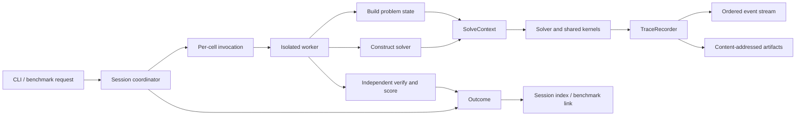

# Universal dev-mode solve observability

Status: proposed design; no runtime code has been changed.

This document defines a universal dev-mode data-gathering system for
`stem4humanity`. It is based on the current harness, all seven implemented problem
families, all 32 registered solvers, and the four existing ad hoc traces.

## Executive decision

Build a runner-owned, event-sourced observation layer with four parts:

1. A universal run lifecycle, event envelope, storage layout, and recorder.
2. A problem codec that records the immutable problem seen by a solver and
   encodes solutions.
3. A solver trace contract that defines that solver's logical state and the
   meaning of one atomic step.
4. Versioned, problem- or algorithm-specific event payloads inside the
   universal envelope.

Pass the observation layer explicitly to solvers through a `SolveContext`.
Production receives a null recorder and does no serialization or I/O. Dev mode
receives a real recorder. The harness, rather than each solver, owns run start,
run end, errors, skips, verification, and timeouts.

Do **not** try to impose one universal state object on every solver. A Dijkstra
frontier, a branch-and-bound tree, a dynamic-programming table, a partially
packed set of bins, and a local-search tour do not have a useful common state
shape. What can be universal is the envelope around those states and the
contract that makes them complete, ordered, versioned, and replayable.

The important limitation is also explicit: no framework can automatically see
the internal decisions of arbitrary native, compiled, or third-party code. An
external call can be observed completely at its boundary, but its internal
algorithm requires a callback-capable library or an instrumented implementation.
The trace must report this distinction instead of pretending that it has full
coverage.

## The exact guarantee

“Record every step and know the state” needs a precise definition. Otherwise
one solver will emit every loop iteration, another will emit only incumbents,
and both will claim to be fully traced.

For an algorithm-complete, full-profile trace, `stem4humanity` should guarantee:

> For every atomic semantic step declared by the solver's versioned trace
> contract, the trace contains an ordered event identifying the logical state
> before the step, the action or alternatives considered, the outcome, and the
> logical state after the step. Starting with the initial checkpoint, a reader
> can reconstruct the state at every event boundary without rerunning the
> solver.

An **atomic semantic step** is the smallest operation the solver declares as a
meaningful unit of its decision process. It is not a Python bytecode, floating
point instruction, allocation, or arbitrary source line. Examples are:

- evaluating and accepting or rejecting one item in greedy knapsack;
- settling one node or relaxing one arc in shortest path;
- expanding, pruning, or generating one search node;
- computing one DP cell, endpoint, or explicitly declared vectorized layer;
- evaluating one 2-opt move and optionally accepting it;
- scoring a batch of candidates and choosing one candidate;
- changing one unit commitment or applying one terminal repair.

The declared granularity is stored with the run. A vectorized DP layer may be
one physical operation, but if its trace contract calls the individual cells
atomic, the trace must preserve all cell outcomes, possibly in a lossless batch.
This makes “full” an auditable property rather than a vague logging level.

“Logical state” means all solver-visible information that may affect later
control flow or decisions, plus the current partial solution and incumbent. It
does not mean a dump of the Python process or every derived temporary. A value
may be omitted only when it is a deterministic derivation of the recorded
problem, solver configuration, and recorded logical state; the trace contract
must name that derivation.

## What exists today

The current architecture has good foundations:

- `Instance` is intended to be fully serializable.
- `ProblemState` verifies and scores a returned solution.
- `Solver.solve` is a small common boundary.
- the harness already creates one `(instance, solver)` cell, verifies the
  result independently, and isolates cells in a worker for hard timeouts;
- solver and problem registries provide a place to enforce new contracts.

Current dev tracing lives in `stem4humanity/util/tracing.py`. It stores a global
session directory, lets a solver derive a JSONL filename, and appends arbitrary
dictionaries. Four of the 32 registered solvers use it:

| Solver | Current records |
|---|---|
| `bp-exact-dfs` | problem, selected search nodes, incumbents, result |
| `ps-learned-priority` | problem, score arrays, scheduling steps, result |
| `uc-exact-dp` | problem, one frontier summary per hour, result |
| `uc-priority-list` | problem, one commitment summary per hour, result |

That experiment demonstrates the value of traces, but it cannot be the final
contract:

- The other 28 solvers produce no trace file at all.
- `kind` is solver-local. For example, two unrelated `hour` records have
  different meanings and fields.
- There is no schema version, sequence number, run ID, state identity, solver
  configuration, model identity, code identity, or completeness statement.
- Problem data is manually copied by each solver, so it is duplicated and can
  be inconsistent. Manifest fields such as family, seed, split, and best-known
  value are absent.
- An unexpected exception, constructor failure, invalid result, or hard timeout
  may have no terminal trace record because lifecycle handling lives inside the
  solver. A killed worker cannot run a `finally` block.
- The global active directory depends on `fork` inheritance, is awkward for
  concurrent or nested runs, and is not portable to process start methods that
  do not inherit globals.
- Each record opens and closes its file, and there is no size policy,
  backpressure policy, artifact store, or corruption marker.
- Sampling is not declared. A reader cannot tell whether absent search nodes
  never happened or were intentionally dropped.
- Instrumentation can accidentally change solver accounting. In the current
  bin-packing DFS, for example, the node counter is incremented only while a
  trace is active. Work counters must belong to the algorithm, never to the
  observer.
- Session traces and `benchmark.json` are not linked by a stable run ID.

These are lifecycle and data-model problems, not reasons to discard JSONL or
the existing solver instrumentation.

## Requirements

The design should satisfy the following requirements.

### Coverage and correctness

- Every benchmark cell gets an invocation and outcome, including `ok`,
  `skipped`, `error`, `invalid`, `timeout`, and harness interruption.
- Every implemented registered problem has a codec for its solver-visible
  immutable state and solution representation.
- Every registered solver declares its atomic steps, logical state schema,
  supported trace profiles, and opaque regions.
- Full traces never silently sample or aggregate away declared atomic steps.
- Every event is associated with a reconstructable state before and after it.
- The harness remains the authority for feasibility and objective value.
  Solver-reported and harness-computed values are stored separately.

### Reproducibility

- Record the complete instance descriptor, the built-state fingerprint, solver
  constructor parameters, random seeds, budgets, model hashes and metadata,
  dependency/runtime identity, and code identity when available.
- Use monotonic sequence numbers as the authoritative order. Timestamps are
  observations, not ordering keys.
- Preserve the train/validation/test split and data provenance if traces later
  become training data.

### Safety and operability

- Production performs no trace filesystem I/O and no expensive trace
  serialization.
- Dev tracing never changes algorithm-owned counters, random-number streams,
  tie breaking, or decisions, except for the unavoidable effect of added time
  on wall-clock-limited runs.
- A hard timeout or killed worker leaves a readable prefix and a parent-written
  authoritative outcome.
- Multiple cells, repeated runs, and identical instance/solver names cannot
  collide.
- Non-finite floats, NumPy values, large arrays, and arbitrary mapping keys have
  defined encodings; emitted JSON is strict JSON.
- Trace limits and failures are visible in metadata. No data may disappear
  silently.

### Extensibility

- A new problem or solver adds a codec/contract without changing the core event
  envelope.
- Readers tolerate unknown namespaced event names and payload fields.
- Schemas are versioned; old data is not reinterpreted in place.
- Raw traces remain the source of truth. Derived tables and learned features
  are reproducible products with their own versions.

## Proposed architecture



The session coordinator reserves a run ID and writes the invocation before the
worker starts. The worker receives an explicit trace configuration, builds a
fresh problem state, constructs the solver, and calls it with a `SolveContext`.
The worker records detailed events and returns its result. The harness verifies
the solution and writes the outcome. If the worker times out, the parent writes
the timeout outcome after terminating it; the worker is not trusted to emit a
final record.

There are five data layers:

1. **Session**: configuration and environment shared by many cells.
2. **Invocation**: immutable identity and inputs for one cell.
3. **Problem snapshot**: the exact immutable state exposed to the solver.
4. **Events and artifacts**: the ordered solve process and reconstructable
   mutable logical state.
5. **Outcome**: authoritative completion status, independently verified
   solution, objective, timing, and trace completeness.

## Storage layout

Keep streaming JSONL as the human-readable raw event format, but stop using
names derived from instance names as identities.

```text
data/sessions/session-<UTC>-<random-suffix>/
  session.json
  index.jsonl
  instances/
    <instance-sha256>.json
  problem-states/
    <state-sha256>.json
  artifacts/
    <sha256>.json
    <sha256>.npy
  runs/
    r000001/
      invocation.json
      events.jsonl
      outcome.json
    r000002/
      invocation.json
      events.jsonl.partial
      outcome.json
```

`r000001` is an opaque cell ID. Human names remain metadata. An instance or
large immutable state shared by multiple solvers is stored once by content
hash. Dense numeric arrays can use `.npy` with `allow_pickle=False`; ragged
structures remain strict JSON. Every artifact reference includes media type,
byte length, hash, and, for arrays, dtype and shape.

An incomplete `events.jsonl.partial` is valid evidence after a crash or hard
timeout. Readers consume complete lines only and consult `outcome.json` for the
authoritative terminal status. Normal completion flushes and closes the stream
before it is marked complete. This avoids relying on a killed child to append a
terminal event.

The worker should own one unique event file and write in unbuffered binary mode.
Encode a whole line before writing it, retry short writes, and permit at most one
incomplete final line if the process is killed during a write. Flush artifact
contents before emitting an event that references them; publish an artifact
under its final content-hash name only after it is complete. A normal terminal
path flushes and `fsync`s the stream. On timeout, the parent derives `last_seq`,
event count, and bytes from complete lines rather than trusting child-returned
counters. This is sufficient for process-kill durability; machine/power-loss
durability can use a stricter configurable sync interval if it becomes a
requirement.

Publishing into the shared artifact directories must be idempotent and
race-safe: write to a run-unique temporary name, atomically claim the final hash
name, and, if another worker already published it, verify its hash/metadata and
reuse it. Event files themselves are per-run and therefore have only one
writer.

`index.jsonl` contains one compact parent-written row per run so sessions can be
listed without opening every event stream. `BenchmarkRun` should contain the
session ID, run ID, and relative trace location; the benchmark result and trace
then refer to the same cell rather than two coincidentally similar filenames.

JSONL is the source format because it streams, survives partial runs, diffs
reasonably, and requires no database writer coordination. A later command may
materialize normalized Parquet or DuckDB tables for analysis, but those are
derived caches, not the only copy of the trace.

## The three contracts

The following interfaces are illustrative, not a demand for these exact Python
names.

### 1. Problem trace codec

Each implemented `Problem` supplies a codec:

```python
class ProblemTraceCodec(Protocol):
    schema_id: str
    schema_version: int

    def encode_instance(self, instance: Instance) -> JSONValue: ...
    def encode_state(self, state: ProblemState) -> EncodedValue: ...
    def fingerprint_state(self, state: ProblemState) -> str: ...
    def encode_solution(self, solution: Any) -> EncodedValue: ...
```

The raw `Instance.to_mapping()` remains part of the invocation. `encode_state`
captures the immutable state actually visible to the solver, including derived
data when it matters. For example, a Euclidean TSP instance contains points,
while its solver-visible state also contains the derived distance matrix. Large
values may be artifact references.

The problem codec owns solution serialization because the problem, not the
solver, defines a valid solution. The harness decodes/verifies the same value it
stores. This replaces the permissive `_sanitize` convention with an explicit,
testable representation.

### 2. Solver trace contract

Every solver class declares something equivalent to:

```python
TraceContract(
    id="shortest-path.dijkstra",
    version=1,
    state_schema="shortest-path.dijkstra-state/v1",
    atomic_steps={
        "select-pivot": "choose the next unsettled reachable node",
        "settle-node": "mark the chosen node settled",
        "relax-arc": "evaluate one outgoing arc and accept or reject it",
    },
    supported_profiles={"full", "decisions", "summary"},
    derived_state={"unsettled": "nodes minus settled"},
    opaque_components=(),
)
```

The contract defines:

- the state schema and its version;
- initial checkpoint contents;
- every atomic step name and boundary;
- which state values are recorded versus deterministically derived;
- profile behavior;
- whether a logical event batch is lossless;
- external or compiled spans whose internals are opaque;
- a coverage scope: `algorithm`, `boundary`, or `lifecycle`.

Registration should reject a dev-ready solver with an invalid contract. A new
solver may initially declare lifecycle-only or boundary-only coverage, but a
full dev run must report that limitation prominently. It must never be labeled
algorithm-complete by default.

Constructor configuration also belongs in the solver contract. The current
`Solver.describe()` returns only ID and tags. It should return actual constructor
values, algorithm version, deterministic seeds, and model references. ML model
references include a content hash and training metadata, not just a path.

### 3. Explicit solve context and recorder

Evolve the solve boundary compatibly:

```python
def solve(
    self,
    state: ProblemState,
    *,
    budget_seconds: float | None = None,
    context: SolveContext | None = None,
) -> SolverResult:
    ...
```

Direct calls that omit `context` receive a production/null context. The harness
always passes one explicitly.

```python
class SolveContext:
    run_id: str
    trace: TraceRecorder
    budget: SolveBudget

    def child(self, component: str) -> SolveContext: ...

class TraceRecorder(Protocol):
    enabled: bool
    profile: TraceProfile

    def span(self, name: str, **attributes: JSONValue): ...
    def checkpoint(self, state: JSONValue, **attributes: JSONValue) -> StateRef: ...
    def observe(self, name: str, *, state: StateRef, **fields: JSONValue): ...
    def transition(
        self,
        name: str,
        *,
        before: StateRef,
        delta: list[PatchOperation],
        action: JSONValue,
        outcome: JSONValue,
        metrics: JSONValue | None = None,
    ) -> StateRef: ...
    def artifact(self, value: Any, **metadata: JSONValue) -> ArtifactRef: ...
```

The exact API can be smaller, but it must preserve these ideas:

- solvers emit semantic events, never open files;
- the recorder assigns run IDs, sequence numbers, timestamps, state IDs, and
  artifact hashes;
- nested helpers and fallback solvers receive `context.child(...)` so their
  events remain in the same run with a distinct component/span;
- expensive snapshot construction is guarded by `trace.enabled` and profile;
- the null recorder allocates no artifacts and performs no I/O;
- shared algorithm kernels accept a recorder/context, so instrumentation is
  implemented once.

Avoid a module-global “active trace.” Explicit context is testable, reentrant,
works with any multiprocessing start method, and makes nested solver calls
unambiguous.

## Universal event envelope

Every logical event uses the same envelope. Detailed payload names are
namespaced and versioned.

```json
{
  "schema": "stem4humanity.trace-event/v1",
  "session_id": "01K1...",
  "run_id": "r000042",
  "seq": 37,
  "elapsed_ns": 1834201,
  "category": "transition",
  "name": "shortest-path.relax-arc/v1",
  "component": "dijkstra",
  "phase": ["solve", "relaxation"],
  "state_before": "s12",
  "state_after": "s13",
  "action": {
    "tail": 2,
    "head": 7,
    "weight": 1.5
  },
  "outcome": {
    "accepted": true,
    "old_distance": 5.2,
    "candidate_distance": 4.7
  },
  "delta": [
    {"op": "replace", "path": "/distances/7", "value": 4.7},
    {"op": "replace", "path": "/parents/7", "value": 2}
  ],
  "metrics": {
    "frontier_size": 4
  }
}
```

Required envelope fields are schema, run ID, contiguous sequence number,
elapsed monotonic time, category, event name, component, phase, and state
references. The session ID may be inherited from the file to reduce repetition
on disk, but readers expose it on every decoded event.

Use a small common category vocabulary for cross-solver analysis:

| Category | Meaning |
|---|---|
| `lifecycle` | run, construction, solve, verification, and outcome boundaries |
| `phase` | start/end of preprocessing, prediction, construction, search, repair, or postprocessing |
| `evaluation` | a candidate, transition, edge, move, or alternative was scored without necessarily mutating state |
| `decision` | alternatives were compared and one action was selected |
| `transition` | logical solver state changed |
| `bound` | a valid lower/upper bound or relaxation result was computed |
| `prune` | work was discarded, with a machine-readable reason |
| `incumbent` | the best feasible solution changed |
| `prediction` | an ML model produced scores, probabilities, or classes |
| `checkpoint` | a full reconstructable state snapshot |
| `diagnostic` | warnings, counters, trace limits, or explicitly opaque calls |

The `name` supplies precise semantics, such as
`bin-packing.place-item/v1` or `tsp.two-opt-evaluation/v1`. Readers can group by
common category without knowing every problem, while domain-aware readers use
the namespaced payload.

Objective and bound fields should share a common representation:

```json
{
  "objective": {"value": 123.4, "sense": "minimize", "feasible": true},
  "bound": {"value": 118.0, "kind": "lower", "valid": true}
}
```

Do not encode maximizing problems by silently negating their values. Preserve
the original value and objective sense.

Sequence number, not timestamp, defines order. Wall-clock UTC belongs in the
session/invocation. `elapsed_ns` is useful for a timeline but includes some
observer effect and must not be used to replay decisions.

## State reconstruction

Full snapshots on every event are simple but can make an exponential search
trace larger than the search itself. Store one initial snapshot, ordered deltas,
and periodic snapshots:

1. The initial checkpoint creates state `s0`.
2. A non-mutating observation references the same state before and after.
3. A transition contains a strict patch and creates the next state ID.
4. A checkpoint at phase boundaries and every configurable number of
   transitions stores the complete state and a hash.
5. A replayer begins at any checkpoint and applies patches in sequence.

Use a small, deterministic patch vocabulary, preferably RFC 6902 JSON Patch for
JSON-shaped logical state. If dense-array patching later needs a compact binary
form, version it as a separate encoding rather than overloading JSON Patch.
Checkpoint hashes catch encoder, recorder, or replay bugs.

Every event references a state even when the state data is stored in an
artifact. This is how the trace can answer “what was the state here?” without
copying the entire frontier onto every line.

The current problem states are immutable inputs, so events normally reference
the one problem snapshot plus an evolving solver state. If a future problem is
itself dynamic or interactive, its mutable domain state becomes a versioned
section of the same logical state and is changed by recorded transitions; it
must not be hidden behind the one-time instance snapshot.

Logical state generally contains four sections:

```json
{
  "control": {},
  "working": {},
  "candidate": {},
  "incumbent": {}
}
```

- `control`: cursor, depth, phase, iteration, pending stack/queue, and RNG state
  or recorded random choices.
- `working`: distances, capacities, frontier, DP layer, machine availability,
  partial assignments, or other decision-relevant values.
- `candidate`: the alternative currently being evaluated.
- `incumbent`: the best feasible solution and objective so far.

This is a convention, not a requirement that all values be present or inline.
Solver-specific schemas define exact fields.

Search-node identity deserves special treatment. Tree/graph search events should
use stable node IDs and parent IDs. A node event records the node's local state,
bound, depth, generation reason, and disposition. This allows analysis of the
search tree without storing a full copy of every Python stack or heap entry.
The active stack/queue is reconstructable from generate/push/pop/prune events
and periodic checkpoints.

## Trace profiles and completeness

Storage volume varies by orders of magnitude, so support explicit profiles:

| Profile | Required content |
|---|---|
| `full` | every declared atomic step; pre/post state reconstructable; no lossy sampling |
| `decisions` | every state-changing decision, prediction, prune, incumbent, and phase checkpoint; rejected alternatives may be summarized |
| `summary` | lifecycle, phase summaries, periodic metrics, incumbents, final state |

`--mode dev` should request `full` by default because that matches the stated
purpose of dev mode. A user can explicitly request a smaller profile. Physical
compression or lossless batching does not reduce the achieved profile; sampling
does.

Each outcome reports both requested and achieved coverage:

```json
{
  "trace": {
    "requested_profile": "full",
    "achieved_profile": "full",
    "coverage_scope": "boundary",
    "complete": true,
    "event_count": 48320,
    "bytes": 9182331,
    "last_seq": 48319,
    "dropped_events": 0,
    "opaque_components": ["networkx.max_weight_matching"],
    "termination": "solver-returned"
  }
}
```

Profile and scope are different. A full, boundary-complete trace of a NetworkX
call can contain every `stem4humanity` step and the exact call input/output while
still declaring the library's internals opaque. `algorithm` scope is allowed
only when there are no undeclared opaque decisions below the chosen algorithm
boundary.

Full mode must not silently throttle. If a configured event or byte limit is
reached, emit `diagnostic.trace-limit-reached` when possible and mark the trace
incomplete. The overflow policy should be explicit: fail the dev run, or
continue solving with tracing disabled. For research datasets, failing is safer
because incomplete traces cannot accidentally enter a “complete” corpus.

Serialization, schema-validation, and artifact-write failures use the same
explicit policy. The recommended default for full profile is to fail the dev
cell and preserve the error; an opt-in `continue` policy may preserve the solver
result but must set `complete: false` and retain the first recorder error. A
recorder failure must never be swallowed while the run is labeled complete.

Lossless batching is allowed when it preserves order and every logical item.
For example, a vectorized DP layer may store all cell inputs, selected parents,
and results in an array artifact. A domain reader can expand it into the atomic
events specified by the contract. Merely storing the minimum value and cell
count would be a summary, not a full trace.

## Harness-owned lifecycle

One cell should execute in this order:

1. The parent reserves `run_id`, writes `invocation.json`, and appends a
   `started` index entry.
2. The worker receives the `Instance`, solver ID/config, and `TraceConfig`
   explicitly. It does not inherit an active global session.
3. The worker builds a fresh `ProblemState` for this cell. Reusing one state
   object across solvers is unsafe if a future state or solver is mutable.
4. The problem codec stores/fingerprints the solver-visible immutable state.
5. The worker constructs the solver. Model loading is a named span, so missing
   or corrupt models are observable constructor outcomes.
6. The solver runs with `SolveContext`. Shared helpers receive the same context
   or a child context.
7. The worker returns the solver result and flushes its event stream in a
   `finally` block.
8. The harness independently serializes, verifies, and scores the solution. It
   stores solver-reported cost/time separately from harness-computed cost and
   measured wall time.
9. The parent writes `outcome.json`, the final index row, and the linked
   `BenchmarkRun` data.

If the worker raises, its structured exception includes class, message, phase,
and a dev-only traceback. If it is killed, the parent writes `timeout` and marks
the stream partial. If the entire harness is interrupted, the invocation with
no outcome is distinguishable from a solver failure.

Session activation and closure belong in a context manager or `try/finally` so
an exception cannot leave tracing globally active.

The outcome is authoritative for terminal status. Lifecycle events in the
stream are useful for timelines, but analytics must not infer success merely
from a solver-written `result` event.

## Production behavior and the observer effect

Production uses a singleton `NullTraceRecorder`. Inner loops should hoist the
enabled/profile check and avoid constructing payloads:

```python
record_full = context.trace.transition if context.trace.full else None

for candidate in candidates:
    # ordinary solver work
    if record_full is not None:
        record_full(...)
```

There is no file lookup, JSON conversion, timestamp call, or model-feature copy
in the disabled branch. Shared algorithm counters are updated regardless of
tracing. Trace code observes those counters; it never owns them.

With no wall-clock cutoff, deterministic prod and dev runs must return the same
solution, objective, exact flag, and algorithm work counters. Add differential
tests for this.

A full trace inevitably consumes CPU and I/O. Therefore:

- prod remains the mode for performance leaderboard measurements;
- dev timings are labeled as traced timings;
- record serialization/I/O time separately when practical;
- a wall-clock budget or hard timeout can make dev explore less work than prod,
  even if every decision before the cutoff is identical;
- comparisons of time-bounded behavior must record the trace profile and cannot
  assume prod/dev equivalence.

Longer term, cooperative solvers should use the budget object in `SolveContext`
rather than private `perf_counter` deadlines. That centralizes cancellation and
makes the clock policy explicit, but it is not required to build the first
version of the recorder.

## Coverage of all current solver families

The following audit maps every registered solver to a viable atomic step and
logical state. It shows that the interface covers the current repository without
forcing unlike algorithms into one payload.

| Current solvers | Full-profile atomic steps | Logical state that must be reconstructable | Implementation boundary |
|---|---|---|---|
| `bp-ffd`, `bp-learned-order` | score/order item; test a bin; place item or open bin | item cursor/order, bin contents and loads, optional ML scores | instrument shared `first_fit_loads` once |
| `bp-large-items-greedy` | consider partner; pair or leave single | ordered/unplaced items, current pair, packing | pure Python |
| `bp-large-items-exact` | build eligible edge; invoke matching; materialize pair | graph and resulting matching/packing | NetworkX blossom internals are opaque unless replaced/instrumented |
| `bp-exact-dfs` | enter node; test placement; compute bound; prune; improve incumbent | order, DFS path, bin loads/contents, bound, incumbent, node/parent IDs | replace current undeclared throttling with profile-aware events |
| `knapsack-greedy-density` | evaluate item; accept/reject | order, remaining capacities, selection, value | pure Python |
| `knapsack-dp-exact` | process cell or declared vectorized item layer; reconstruct choice | current/previous values, choices, item/capacity cursor | NumPy layer can be a lossless batch artifact |
| `knapsack-bnb-exact` | pop node; bound/prune; generate include/exclude child; improve incumbent | stack, node state, selection, capacities, bound, incumbent, deadline state | pure Python |
| `ps-cp-list`, `ps-list-scheduling`, `ps-learned-priority` | score task; choose available task; assign machine; release successors | available set/order, predecessor counts, assignments, starts, machine-free times, scores | instrument shared `list_schedule`; learned solver adds prediction span |
| `ps-hu` | form time-slot candidates; choose and assign each task | levels, remaining predecessors, assignments, machine state, time | pure Python |
| `ps-exact` | enter DFS node; compute lower bound; try machine; prune; improve incumbent | DFS path, assignments, starts, machine-free vector, used machines, incumbent | pure Python |
| `jobshop-greedy` | evaluate available operation; dispatch chosen operation | next steps, machine-free/job-finish arrays, per-machine orders | pure Python |
| `jobshop-bnb-exact` | evaluate one ordering combination; improve incumbent | permutation cursors or combination ID, orders, evaluated count, incumbent | `itertools` iteration is observable at each returned combination |
| `johnson-flow-shop` | classify job; order first/second partition; concatenate | partitions and final permutation | pure Python |
| `learned-flow-shop` | score one comparator call; accept ordering relation; finish sort | comparison operands/scores, comparison history, resulting permutation | Python sort internals are boundary-visible through comparator calls; actual call count must be recorded, not estimated |
| `dijkstra` | select pivot; settle node; evaluate/accept/reject each relaxation | distances, parents, settled set, pivot/frontier | pure Python |
| `dag-topological-relaxation` | update in-degree/ready queue; emit topological node; relax arc | in-degrees, queue/order, distances, parents | instrument topological helper and relaxation |
| `learned-sp-pruning` | score arcs; keep/prune each arc; relax kept arcs; enter fallback | scores/mask, pruned graph, distances/parents, fallback status | fallback Dijkstra is a child component in the same run |
| `general-2opt` | construct candidate tour; evaluate/accept 2-opt move; select best start | remaining cities, candidates, current/best tours and costs, restart/RNG choices | pure Python shared local-search functions |
| `chained-2opt-euclidean`, `distance-ranked-2opt`, `learned-candidate-2opt` | construct hull/insertion; build/rank candidates; evaluate move; perturb/restart; update incumbent | candidate lists/scores, current/best tours, costs, accepted moves, random cuts | instrument shared geometry/local-search kernels; learned solver adds model span |
| `held-karp` | initialize base cell; evaluate endpoint recurrence; choose parent; close/reconstruct tour | subset/endpoint cursor, relevant DP costs and parents, final choice | Numba kernel needs a trace-capable dev kernel or remains compiled-opaque |
| `incremental-exact` | create/pop node; bound/prune; patch cycle cover; branch edge; repair/generate child; improve incumbent | priority queue via node events, forced/forbidden edges, assignment/cycles/duals, bound, incumbent | pure Python/NumPy; array artifacts prevent huge inline events |
| `uc-priority-list`, `uc-learned-commitment` | score unit; test decommit/start; choose mask; dispatch hour; update ages | priorities/probabilities, status/ages, committed power, partial schedule/cost | instrument shared `priority_list_schedule`; learned solver adds prediction span |
| `uc-exact-dp` | evaluate a state-to-mask transition; reject/update frontier entry; finish hour; reconstruct | hour, current/next frontier, predecessor links, dispatch cache reference, incumbent partial state | full transition batches can be large; current per-hour records are summary profile |
| `uc-storage-threshold`, `uc-storage-learned` | compute/predict period action; simulate action; perform each terminal-repair edit | actions, energy/profile, charge/discharge schedule, target gap, scores/thresholds | instrument shared simulation and repair helpers |
| `uc-storage-dp` | evaluate discharge window and charge choices for a period/energy; select action; reconstruct | period, value layer, arg arrays, energy cursor, partial schedule | lossless array batches; pure Python/NumPy |

All 32 solvers appear in the table. The only current algorithm-internal gaps are
the NetworkX blossom call and the Numba Held-Karp kernel. They are not a failure
of the event model; they are honest instrumentation choices:

- accept boundary-complete traces and record exact inputs/outputs; or
- provide trace-capable implementations for dev mode and test them against the
  production implementation on the same instances.

If dual implementations are used, the outcome must record which engine ran,
and differential tests must establish identical tie-breaking/results. A dev
implementation must never masquerade as a trace of a different production
execution.

## Shared-kernel instrumentation is the leverage point

Several solvers are thin wrappers over common algorithms. Instrumenting the
shared kernel avoids drift and immediately covers controls and learned variants:

- `first_fit_loads` covers FFD and learned-order bin packing;
- `list_schedule` covers three parallel-scheduling solvers;
- `priority_list_schedule` covers classical and learned unit commitment;
- `simulate_actions` and `repair_terminal` cover both storage heuristics;
- the TSP construction and 2-opt helpers cover hand-designed, distance-ranked,
  and learned-candidate variants;
- shortest-path relaxation can be factored into a traced common helper;
- ML wrappers add prediction events, then pass a child context to the classical
  kernel.

The helper should receive the context/recorder explicitly. A generic callback
of `dict -> None`, as used today, still leaves schema, state identity, profiles,
and nested spans to every caller.

## ML-specific provenance

For learned solvers, behavior cannot be explained by an algorithm ID alone.
Record:

- model content hash, format, class, training metadata, and feature-schema
  version;
- all inference-time parameters such as threshold and top-k;
- features by artifact reference when they are needed to reproduce a score;
- raw scores/probabilities before thresholding or ranking;
- the selected candidates/actions and deterministic tie breakers;
- fallback or repair decisions.

Do not copy the entire model into every run directory. Store or reference it by
content hash. If a referenced model can later be overwritten, preserve an
immutable artifact or fail the reproducibility grade.

Traces used to train future solvers must retain the source instance split and a
lineage record naming the trace schema, feature extractor, model, and source
session IDs. Otherwise the framework can silently train on test-instance
behavior and report misleading gains.

## Serialization rules

Define one strict normalization layer used by problem codecs, event payloads,
solver metadata, and outcomes:

- JSON primitives remain primitives.
- NumPy scalars become Python scalars.
- Small arrays become nested lists; large arrays become typed artifact refs.
- Tuples become arrays unless a schema says they represent a structured object.
- Mapping keys become strings only through a schema-defined encoding; do not
  silently stringify keys in a way that can collide.
- `NaN`, positive infinity, and negative infinity use explicit tagged values or
  are rejected. Do not emit non-standard JSON numeric tokens.
- Sets use deterministically sorted arrays where ordering is not semantic.
- Exceptions use structured fields, not only a formatted string.
- Every content hash is computed over a canonical representation.

Set size thresholds in the session configuration so a reader knows why one
array was inline and another became an artifact. Artifact placement is a
storage detail and must not change event semantics.

## Schema evolution

Version the envelope and each logical state/event schema independently:

- `stem4humanity.trace-event/v1` is the envelope.
- `shortest-path.dijkstra-state/v1` is a solver logical state.
- `shortest-path.relax-arc/v1` is a payload.

Adding optional envelope fields does not require a new major version. Changing
the meaning or required fields does. Event names are permanent once data using
them exists. Readers ignore unknown optional fields and preserve unknown event
payloads. Migrations create a new derived dataset; they do not rewrite the only
copy of raw sessions.

Keep JSON Schema files with the implementation and validate traces in tests.
Solver-specific semantic validators should additionally check facts JSON Schema
cannot express, such as a Dijkstra relaxation's `state_before` distance matching
its recorded candidate value.

## Validation and tests

The design is only trustworthy if completeness is machine-checked. Add these
test categories when implementing it.

### Registry contract tests

- Every implemented problem registers a codec.
- Every solver registers a trace contract with a unique ID/version.
- Every event name emitted by a solver is declared by its contract.
- Opaque components are declared rather than discovered after a run.

### Structural trace tests

- Event sequence numbers are contiguous and unique.
- State references form a valid chain.
- Replaying deltas from every checkpoint yields the same later checkpoint hash.
- Full-profile runs contain every atomic step count promised by the contract.
- All JSON is strict and all artifact hashes/shape/dtype metadata validate.
- A completed run has an invocation, readable stream, outcome, and index row.

### Behavioral equivalence tests

For deterministic instances without time cutoffs, run each solver with the null
recorder and full recorder and compare:

- status, solution, harness-computed objective, and exact flag;
- solver work counters such as nodes, relaxations, comparisons, states, moves,
  and repairs;
- random choices or final RNG state for seeded solvers.

The trace event counts should agree with algorithm-owned work counters. This
catches missing events and observer-owned counters.

### Lifecycle fault tests

Exercise constructor failure, `InapplicableError`, unexpected exception,
invalid solution, objective failure, cooperative budget exit, hard timeout,
worker kill, and harness interruption. In every case the parent outcome and
trace completeness must be unambiguous.

### Concurrency and durability tests

- Run the same instance/solver repeatedly and concurrently; paths must not
  collide.
- Use both `fork` and `spawn` where supported.
- Kill a worker between event writes and verify that the complete prefix is
  readable and marked partial.
- Exceed event/byte limits and verify that no run is reported complete.

### Representative semantic tests

At minimum, maintain tiny golden traces for one greedy solver, graph relaxation,
DP solver, DFS/priority-queue search, local search, ML-guided solver, nested
fallback, and opaque external call. Keep golden instances tiny; assert semantic
invariants rather than volatile timestamps or artifact filenames.

## Suggested implementation order

### Phase 1: universal lifecycle, before detailed solver work

1. Add the session/run models, strict serializer, JSONL recorder, null recorder,
   artifact store, and trace validator.
2. Pass `TraceConfig` explicitly into `_run_cell`; create a `SolveContext` inside
   the worker.
3. Move lifecycle ownership to the harness and link `BenchmarkRun` to `run_id`.
4. Record invocation, raw instance, solver descriptor, problem snapshot, result,
   verification, and all failure statuses for every cell.

After this phase, all 32 solvers have lifecycle-complete traces even before
their internal loops are instrumented.

### Phase 2: codecs, contracts, and replay

1. Implement codecs for the seven current problem state types.
2. Define the envelope, category vocabulary, patch encoding, trace contracts,
   and schema files.
3. Implement checkpoint/delta replay and completeness reporting.
4. Add registry/structural tests so new solvers cannot silently bypass the
   system.

### Phase 3: highest-leverage shared kernels

Instrument `first_fit_loads`, `list_schedule`, `priority_list_schedule`, storage
simulation/repair, and TSP local-search helpers. Migrate the four ad hoc solvers
onto the new recorder at this point and compare their useful existing fields
against the new events.

### Phase 4: remaining pure-Python solvers

Instrument greedy, graph, DP, enumeration, DFS, priority-queue search, and ML
wrapper code by archetype. Add one semantic validator per archetype, then
solver-specific invariants where necessary.

### Phase 5: compiled and third-party boundaries

Choose and record the policy for NetworkX blossom and Numba Held-Karp:
boundary-complete only, callback/fork instrumentation, or a verified trace-capable
dev engine. Do not block the rest of the system on these two choices, but do not
claim algorithm-complete coverage until they are resolved.

### Phase 6: analysis products

Build readers that expose normalized event tables and materialized state, then
derive datasets such as:

- objective/incumbent improvement over steps;
- search branching factors, prune reasons, bound quality, and frontier growth;
- accepted/rejected candidate distributions and decision regret;
- DP frontier/table growth and dominant transitions;
- local-search basin, plateau, restart, and move statistics;
- ML score calibration, ranking quality, fallback/repair frequency;
- state-action-next-state datasets for learned guidance;
- comparisons of shared kernels under classical versus learned priorities.

Derived features should never be embedded back into raw event files. Store the
derivation version and source session/run IDs.

## Alternatives considered

### One universal state dataclass

Rejected. It would either contain meaningless optional fields for every
algorithm or collapse useful state into untyped dictionaries. A universal
envelope plus versioned state schemas gives shared infrastructure without
erasing domain semantics.

### Make every solver a generator that yields states

Rejected as the primary interface. It forces invasive control-flow rewrites,
fits recursion and native calls poorly, and still does not solve lifecycle,
schema, timeout, or storage concerns. A recorder can be called from generators
where they are natural without requiring every algorithm to become one.

### Decorators, Python profiling, or line tracing

Rejected for semantic data gathering. These mechanisms expose implementation
details rather than decisions, generate enormous unstable data, and cannot see
inside NumPy, Numba, NetworkX, or future external solvers. They may help debug a
specific crash, but they are not the research trace.

### Let solvers write their own JSONL

Rejected. It caused the current lifecycle and schema fragmentation. Solvers
should describe semantic events; only the recorder should know storage.

### Store everything in a relational database during the solve

Rejected as the raw format. Per-step transactions complicate worker isolation,
timeouts, schema-specific payloads, and partial recovery. Stream first; build a
query-optimized derived database afterward.

### Store a full snapshot on every step

Rejected as the default because DP and search traces would become unnecessarily
large. Initial/periodic checkpoints plus deltas preserve exact state. Full
snapshots remain useful for small solvers and debugging.

## Definition of done

The universal dev mode is complete when all of the following are true:

- Every benchmark cell, including constructor failures and timeouts, has a
  unique invocation and authoritative outcome.
- Every current implemented problem has a tested codec and every current solver
  has a versioned trace contract.
- A requested full trace states its coverage scope and opaque components.
- For every algorithm-complete full trace, the validator can reconstruct the
  logical state at every declared atomic step and reports zero dropped events.
- The session records instance, built-state, solver config, code/runtime, model,
  budget, seed, split, and result provenance.
- Trace and benchmark records link through the same session/run IDs.
- Prod mode performs no trace I/O and deterministic unbounded prod/dev runs have
  identical solutions and work counters.
- Trace caps, crashes, and timeouts produce explicitly incomplete, readable
  traces rather than apparently successful truncated files.
- Repeated/concurrent runs cannot collide.
- The current four ad hoc traces have been migrated without losing their useful
  information.
- The solver audit table above has an implemented and tested path for every one
  of the 32 registered solvers.

## Final recommendation

Treat dev-mode data as an event-sourced research dataset, not as debug print
statements. Put universal responsibility—identity, lifecycle, ordering,
serialization, storage, validation, and completeness—in the harness and
recorder. Put semantic responsibility—what a step means and what state controls
the next decision—in explicit problem codecs, solver contracts, and shared
kernel instrumentation.

That boundary is universal enough for new optimization problems and solver
styles, while still preserving the details needed to learn why a particular
solver behaved as it did. It also makes gaps honest: a trace can prove it is
complete, or name precisely what it could not observe.
